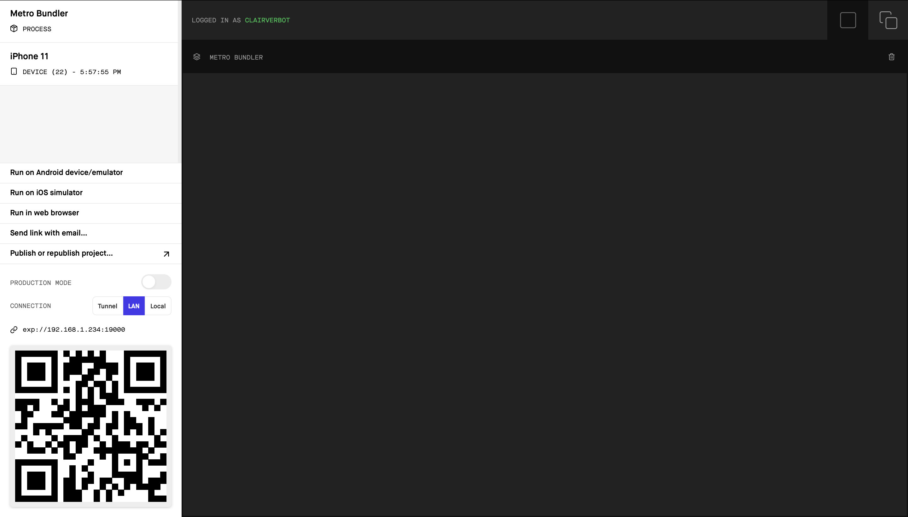

# Hiro

You will need

node: install [here](https://nodejs.org/en/download/) or run `brew install node` if you are on mac and has downloaded [homebrew](https://brew.sh)

yarn: `npm install -g yarn`

## Running the application

1. `yarn install` : Installs the required dependencies

2. `yarn start`: starts the app

After seeing this screen, you can 
1. Scan the QR code on your phone (** download the expo app if you're on android)
2. Click Run on Android (will have to download android studio)/ iOs (needs a mac)Simulator  
    - if you're using mac, i think it is most convenient to run on the iOs simulator

## Examples
I think this is a pretty good starter project to try out react native and expo: https://medium.com/swlh/build-a-simple-react-native-app-thats-not-a-todo-list-9532b3bd2835